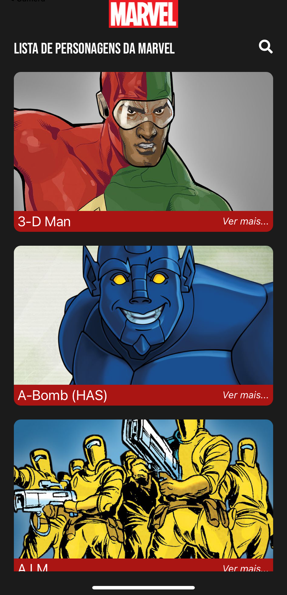
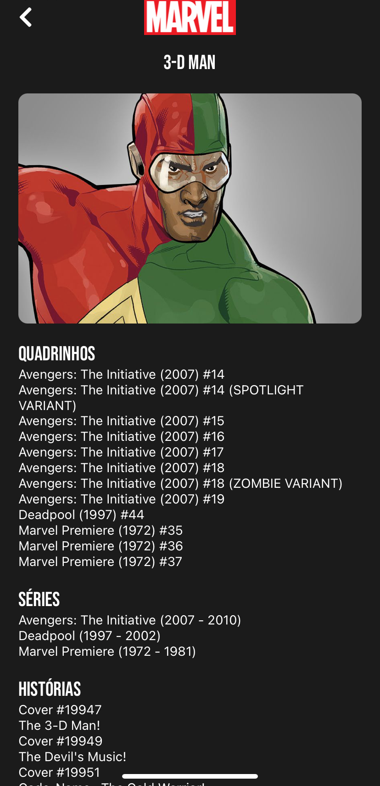

# Marvel Heroes

A React Native Expo app that displays Marvel characters using the API available at https://developer.marvel.com/

<div style="display: flex; justify-content: center;">
  <h4>⚠️ 🚀 Work in progress... ⚠️</h4>
</div>

<br>

## App screenshots

<div style="display: flex;">
  <div style="display: flex; flex-direction: column; margin-right: 10px;">
    <span>Main screen</span>
    
  </div>
  <div style="display: flex; flex-direction: column; margin-left: 10px;">
    <span>Character screen</span>
    
  </div>
</div>

<br>
<br>

## Run the project
```
npm install
npm run android / run ios
```

<br>

## Technologies used
<div style="display: flex; flex-direction: column;">
  <a href="https://reactnative.dev" style="display: flex; align-items: center;">
    
    <h4 style="margin-left: 10px;">React Native</h4>
  </a>
  <a href="https://redux.js.org/" style="display: flex; align-items: center;">
    
    <h4 style="margin-left: 10px;">Redux</h4>
  </a>
  <a href="https://react-redux.js.org/" style="display: flex; align-items: center;">
    
    +
    
    <h4 style="margin-left: 10px;">React Redux</h4>
  </a>
  <a href="https://expo.dev/" style="display: flex; align-items: center;">
    
    <h4 style="margin-left: 10px;">React Redux</h4>
  </a>
</div>

<br>
<br>

Made with  by Euler Momberger [See my linkedin](https://www.linkedin.com/in/euler-momberger/)
